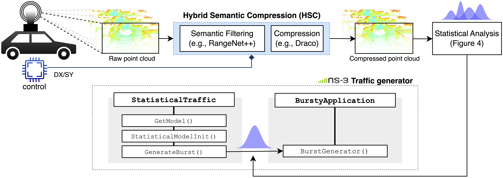

# Statistical Analysis and End-to-End Performance Evaluation of Traffic Models for Automotive Data

Official repository for: [Statistical Analysis and End-to-End Performance Evaluation of Traffic Models for Automotive Data](https://arxiv.org/abs/2504.14017)

📎 **Abstract**: Autonomous driving is a major paradigm shift in transportation, with the potential to enhance safety, optimize traffic congestion, and reduce fuel consumption. Although autonomous vehicles rely on advanced sensors and on-board computing systems to navigate without human control, full awareness of the driving environment also requires a cooperative effort via Vehicle-to-Everything (V2X) communication. Specifically, vehicles send and receive sensor observations to/from other vehicles to extend perception beyond their own sensing range. However, transmitting large volumes of data can be challenging for current V2X communication technologies, so data compression represents a crucial solution to reduce the message size and link~congestion.
In this paper, we present a statistical characterization of automotive data, focusing on LiDAR sensors. Notably, we provide models for the size of both raw and compressed point clouds. The use of statistical traffic models offers several advantages compared to using real data, such as faster simulations, reduced storage requirements, and greater flexibility in the application design. Furthermore, statistical models can be used for understanding traffic patterns and analyzing statistics, which is crucial to design and optimize wireless networks. We validate our statistical models via a Kolmogorov-Smirnoff (KS) test implementing a Bootstrap Resampling scheme. Moreover, we show via ns-3 simulations that using statistical models yields results in terms of latency and throughput that are comparable to real data, which also demonstrates the accuracy of the models.

